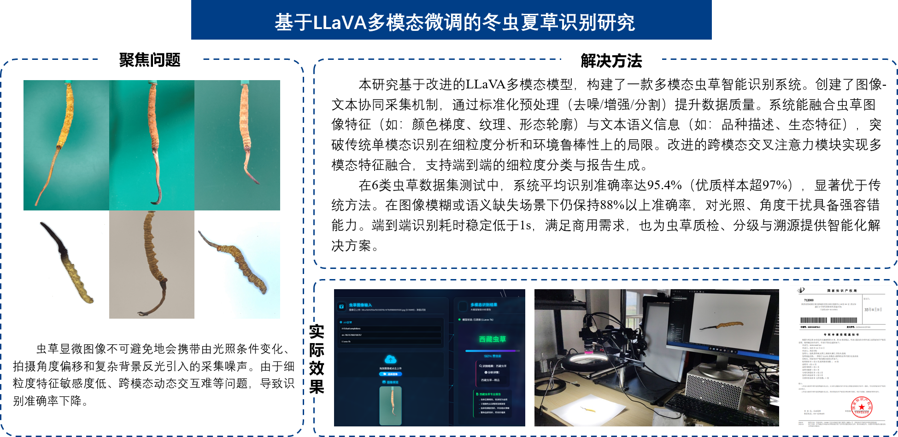
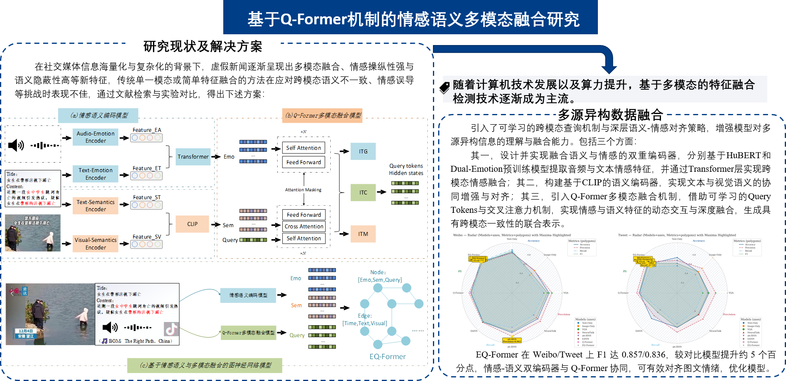
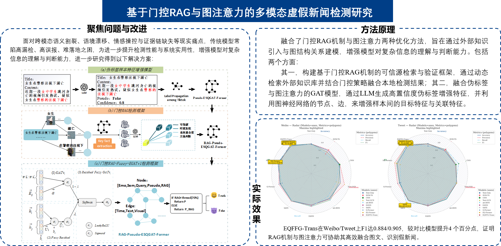
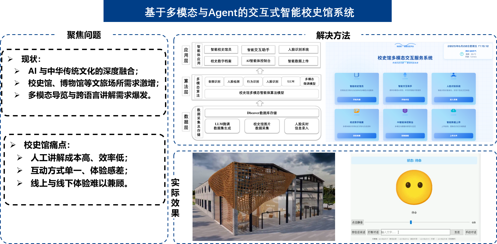
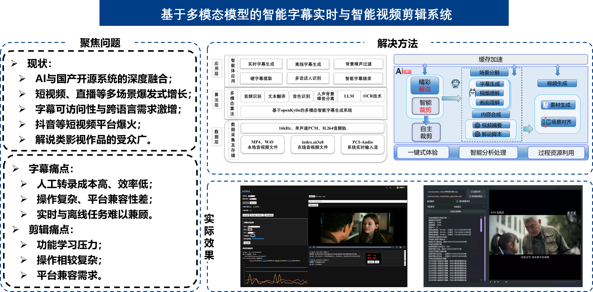
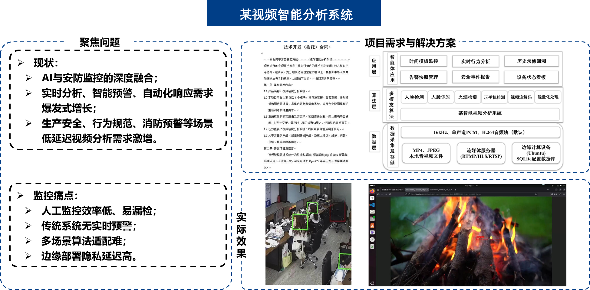

<h1 align="left">Hi, I'm Weibin Cai 👋</h1>

  I build AI projects that connect multimodal data, language models, and practical applications.
  My current interests include multimodal learning, trustworthy AI, and intelligent agents.

  <a href="https://github.com/Zjomo">GitHub: @Zjomo</a>

---

### Selected Projects

#### Multimodal Cordyceps Recognition

An image-and-text recognition system using a fine-tuned multimodal model to identify Cordyceps, with a focus on fine-grained visual features and robust predictions.

`Python` `PyTorch` `LLaVA` `Computer Vision`

  

#### Multimodal Fake News Detection

Research prototypes combining semantic and emotion features, Q-Former fusion, gated retrieval-augmented generation, and graph attention for multimodal misinformation detection.

Reported F1 scores in the presentation: **0.884 on Weibo** and **0.905 on Twitter** for EQFFG-Trans.

`Multimodal Learning` `Q-Former` `RAG` `GAT`

  

  

#### Multimodal Emotion Recognition

A multimodal emotion recognition system using a fine-tuned multimodal model to identify emotions from both text and image data, with a focus on fine-grained visual features and robust predictions.

`Python` `PyTorch` `LLaVA` `Computer Vision`

#### Interactive Intelligent History Museum

A multimodal, agent-based guide concept for interactive history-museum visits, bringing together conversational guidance and cultural content.

`LLM` `AI Agent` `Multimodal Interaction`

  

#### Video Intelligence & Smart Media Tools

Project experience includes video analysis, real-time subtitles, and AI-assisted video editing for practical media and monitoring workflows.

`Video AI` `Speech & Language` `Real-time Systems`

  

#### Edge AI Multi-Channel Video Surveillance System

A C++ edge-box platform that turns RTSP cameras into intelligent monitoring channels — real-time HLS streaming, plugin-style AI detection (fire, smoking, phone use), scheduled analysis, and an alert center with a browser-based management UI.

`Computer Vision``Edge Computing``Real-time Streaming`

  

---

Thanks for stopping by. Feel free to explore my repositories or reach out through GitHub.
